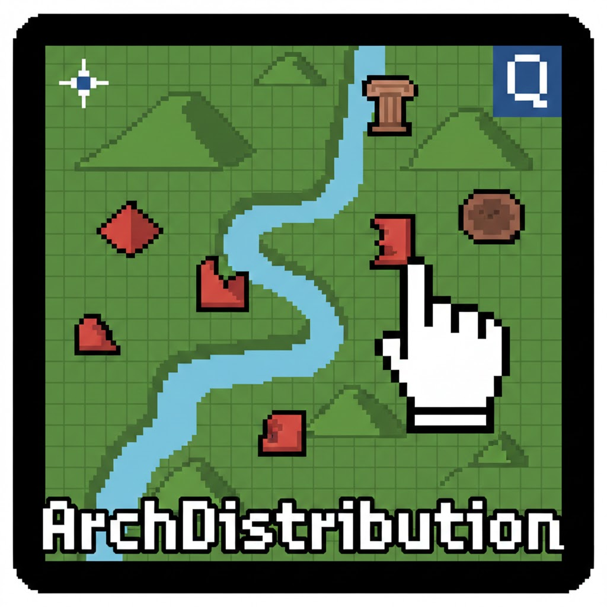
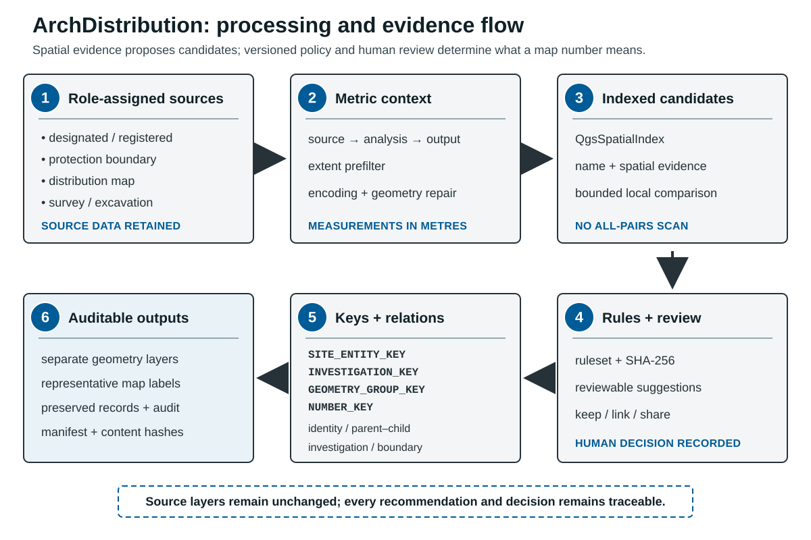

<p align="center">
  
</p>

<h1 align="center">🏺 ArchDistribution</h1>

<p align="center">
  여러 고고유산 공간자료를 검토 가능한 규칙으로 정리해 분포지도를 만드는 QGIS 플러그인<br>
  A QGIS plugin for reviewable reconciliation and mapping of archaeological spatial records
</p>

<p align="center">
  
  
  
</p>

<p align="center">
  <a href="https://github.com/lzpxilfe/ArchDistribution/actions/workflows/ci.yml"></a>
  <a href="https://github.com/lzpxilfe/ArchDistribution/actions/workflows/qgis-integration.yml"></a>
  <a href="https://github.com/lzpxilfe/ArchDistribution/actions/workflows/paper.yml"></a>
</p>

> **원본 레이어는 수정하거나 삭제하지 않습니다.** 결과, 중복 판정 근거,
> 보존된 원본 레코드와 실행정보는 별도 출력으로 남습니다. 그래도 공식 보고서에
> 사용하기 전에는 위치·속성·번호·도면 표현을 사람이 최종 검수해야 합니다.

## ✨ 프로젝트 한눈에 보기 | At a Glance

| 항목 | 내용 |
|---|---|
| 현재 버전 | `1.0.5` |
| QGIS 호환성 | 선언 범위 `3.40` - `3.99`; 자동검증 Windows `3.40.5`, Linux `3.44.13` |
| 지원 언어 | `자동(QGIS)` / `한국어` / `English` |
| 주요 입력 | 조사구역, 지정·등록유산, 분포지도, 지표·발굴조사, 선택적 지형도·Zone 레이어 |
| 주요 출력 | `ArchDistribution_결과물` 그룹, 선택적 GPKG·실행정보·JPG/PDF, `latest_log.txt` |
| 배포 방식 | QGIS ZIP 설치 또는 플러그인 폴더 수동 배치 |

## 👋 처음이라면 여기부터 | Start Here

### 어떤 작업을 하려는 건가요?

| 하려는 작업 | 열 탭·기능 | 핵심 결과 |
|---|---|---|
| 조사대상지 주변의 지정유산·분포지도·발굴조사를 모아 번호가 있는 분포지도 만들기 | `문화유적분포지도` | 대표 유적 레이어, 중복 보존 레이어, 검수표, 버퍼·도곽, 인쇄조판 |
| 주변유적 없이 대상지의 법정 보호·현상변경 기준만 도면화하기 | `문화유적분포지도` + 국가유산청 법정 레이어 | 현상변경·국가/시도 지정·국가/시도 보호구역을 축척 도곽으로 정확히 절단한 공식 범례 레이어 |
| 매장유산 유존지역을 보존조치 4종으로 나누어 표현하기 | `매장유산 유존지역` | 보존조치별 형상·심볼, 공유 번호, 인쇄조판 |
| 이미 검토한 결과는 그대로 두고 번호 순서만 다시 정리하기 | 스타일 탭의 `기존 결과 후속 작업 — 번호만 다시 매기기` | 기존 판정키를 보존한 재번호 결과 |



도면의 후보 생성은 동일성 결정을 뜻하지 않습니다. 공간·명칭 증거로 비교할
대상을 줄인 뒤, 버전이 고정된 규칙과 사람의 검토가 관계·대표 번호를 정합니다.

### 준비할 자료

| 구분 | 필요한 것 | 참고 |
|---|---|---|
| 필수 | 조사구역 레이어와 하나 이상의 고고유산 레이어 | SHP와 GeoPackage를 사용할 수 있습니다. |
| 권장 | 각 입력의 올바른 CRS, 알아볼 수 있는 레이어명·명칭 필드 | CRS가 없거나 변환할 수 없으면 거리를 안전하게 계산할 수 없어 실행을 중단합니다. |
| 선택 | 수치지형도, 현상변경 허용기준(Zone), 출력 폴더 | GPKG·JPG·PDF·실행정보 JSON을 함께 보관할 수 있습니다. |
| 저장 형식 | 결과 보존에는 GeoPackage 권장 | Shapefile은 긴 필드명과 `SRC_JSON` 같은 긴 텍스트가 잘릴 수 있습니다. |

전국 원자료와 실제 유적 좌표는 라이선스와 민감성 때문에 이 저장소에 포함하지
않습니다. 사용자는 권한이 있는 자료를 QGIS에 직접 불러와야 합니다.

### 내 자료로 첫 실행하기

현재 공개 저장소에는 실제 유적 좌표가 없는 완전한 QGIS 공간 예제 프로젝트가
아직 없습니다. 아래 절차는 사용 권한이 있는 자신의 자료로 처음 실행하는
경로입니다. 공개된 `validation/fixtures`는 판정정책용 합성 JSON이며 QGIS에
불러오는 공간 레이어가 아닙니다.

1. QGIS `3.40` 이상을 열고 `Plugins → Manage and Install Plugins → Install from ZIP`을 선택합니다.
2. `ArchDistribution-1.0.5.zip`을 설치하고 플러그인을 활성화합니다.
3. QGIS 프로젝트에 조사구역과 주변 고고유산 레이어를 불러옵니다.
4. ArchDistribution의 `문화유적분포지도` 탭에서 조사구역·유산 레이어를 선택합니다.
5. 자동 추천된 자료 역할을 확인합니다. 모호한 레이어는 임의로 추정하지 말고 직접 역할을 지정합니다.
6. 판형·축척·버퍼 거리와 기본 `균형형` 중복처리를 확인한 뒤 실행합니다.
7. 중복 후보마다 `별도 유지`, `연결만`, `대표 번호로 묶기` 중 하나를 확인합니다.
8. `ArchDistribution_결과물` 그룹의 대표 결과·`중복_보존`·검수표·인쇄조판을 확인합니다.

> **처음 시험할 때 권장값:** 중복처리 `균형형`, GeoPackage와 실행정보 JSON
> 저장 켜기, 도곽 미세조각 제외 켜기. `자동화 우선형`은 규칙을 이해한 뒤
> 사용하는 편이 안전합니다.

### GitHub에서 직접 설치 패키지 만들기

저장소를 clone한 심사자·개발자는 깨끗한 작업 트리에서 다음을 실행할 수 있습니다.

```bash
git clone https://github.com/lzpxilfe/ArchDistribution.git
cd ArchDistribution
python verify_guardrails.py
python create_zip.py
```

`create_zip.py`는 바탕화면에 `ArchDistribution-1.0.5.zip`을 만들며, ZIP 안에는
QGIS가 요구하는 최상위 `ArchDistribution/` 폴더 하나만 들어갑니다.

**English quick path:** Install the versioned ZIP through QGIS Plugin Manager,
load a study-area layer and one or more heritage layers, confirm the suggested
source roles, run the Balanced preset, review every proposed relationship, and
inspect both the representative output and the audit layers. Source layers are
not modified. Build the ZIP from a clean clone with the commands above.

## 🧭 프로젝트 소개 | Overview

**KR**  
ArchDistribution는 고고학 분포지도 제작 과정에서 반복적으로 수행하는 정리 작업을 줄이기 위해 만든 QGIS 플러그인입니다.  
조사구역 기준 버퍼 생성, 주변유적 병합, 번호 부여, Zone 처리, 스타일 적용, 로그 저장까지 한 흐름으로 처리할 수 있도록 구성되어 있습니다.

**EN**  
ArchDistribution is a QGIS plugin built to reduce repetitive GIS work in archaeological distribution mapping.  
It streamlines buffering, heritage-layer merging, numbering, zone processing, styling, and logging in one workflow.

## 🚀 현재 제공 기능 | Current Features

<details>
<summary><strong>전체 기능 목록 펼치기 | Show the complete feature list</strong></summary>

빠른 설치와 첫 실행만 필요하다면 위의 `처음이라면 여기부터`만 읽어도 됩니다.
아래 목록은 세부 동작과 검수 기능을 확인하려는 사용자·심사자를 위한 것입니다.

**KR**
- `조사구역 / 수치지형도 / 주변유적 / Zone` 레이어를 한 화면에서 선택
- 다중 버퍼 거리 입력, 라인 스타일 및 `1,000m 이상 km 표기` 지정
- 버퍼 결과는 `DIST_M`만 남기고 거리 라벨을 자동 표시
- 주변유적 병합 후 자동 번호 부여
- 레이어별 `국가·시도 지정 / 국가·시도 등록 / 보호구역 / 분포지도 / 지표 / 발굴` 역할 자동 판정 및 수동 변경
- 레이어별 UTF-8/CP949 인코딩 명시 선택 및 `.cpg`·공급자 자동 판독
- 원본·분석·출력 CRS를 분리하고 도·피트 자료는 지역 UTM에서 거리·면적·도곽 계산
- 공간 인덱스와 명칭·주소·중첩률을 함께 사용하는 자료 종류별 중복 판정
- `균형형 / 보수형 / 자동화 우선형` 중복처리 프리셋
- 실행 전 검토창에서 `별도 유지 / 연결만 / 대표 번호로 묶기` 선택
- 검토창에서 선택 후보 위치로 지도 확대 및 행 더블클릭 확대
- 원본 내용과 판정 모드가 같을 때만 이전 검토 결정을 안전하게 재사용
- 레이어 ID·피처 ID가 바뀌어도 유지되는 `SRC_UID`와 변경 감지용 `SRC_FP`
- 지정·등록유산과 발굴조사는 별도 번호로 유지하고 분포지도 중복만 우선순위에 따라 대표화
- 지표조사는 자동 소거하지 않고 기본적으로 별도 유지
- 지정유산 보호구역은 본체와 연결된 무번호 경계로 분리
- 대표에서 제외된 형상과 판정 근거를 `중복_보존` 및 `중복_판정_검수표`에 보존
- `사업명`이 같은 발굴 기록은 조사사건과 번호를 공유하되 원본별 유적 실체와 형상 그룹은 보존
- 조사사건(`INVESTIGATION_KEY`)·유적 실체(`SITE_ENTITY_KEY`)·지도 번호(`NUMBER_KEY`)·형상 그룹(`GEOMETRY_GROUP_KEY`)을 별도 기록
- 점·선·면 입력을 형상 계열별 결과 레이어로 유지하면서 전체 번호 순서는 연속 부여
- `문화유적분포지도 / 매장유산 유존지역` 전용 작업 탭 분리
- 매장유산 탭에서 폴리곤과 보존조치 필드를 명시적으로 선택
- `보존조치` 4종의 채움색·외곽선색·두께·불투명도 사용자 설정 및 저장
- 같은 유적의 조치별 경계는 유지하면서 하나의 번호를 공유
- 모든 원본 속성과 그룹 구성원 정보를 결과 레이어에 보존
- `거리순 / 북→남 / 가나다순` 정렬 기준 선택
- 도곽에 걸쳐 잘린 미세 폴리곤 조각을 축척·판형 기준으로 자동 제외
- 버퍼 밖 유적 숨김 처리와 연속 번호 재정렬
- `기존 결과 후속 작업 — 번호만 다시 매기기`로 판정을 유지한 채 수정 후 재번호
- Zone 레이어 자동 분할 및 코드별 스타일 적용
- `버퍼 범위 내 자르기` 옵션으로 Zone 결과를 최대 버퍼 내부로 제한
- 주변유적을 선택하지 않아도 Zone 레이어만으로 현상변경 허용기준 도면 생성
- 현상변경 Zone과 지정·보호구역에 제공 범례 색을 적용하고 인쇄조판 범례에도 반영
- 속성 분류는 원본의 시대·시기·연대 및 성격·유형·종류 필드를 우선 사용
- 출처·라이선스가 확인된 사용자 공급 `reference_data.json` 및
  `smart_patterns.json`이 있으면 명칭 사전·제외 제안을 추가로 사용
- `자동(QGIS) / 한국어 / 영어` UI 전환 즉시 반영
- 실행 로그를 QGIS 화면과 `latest_log.txt`에 함께 저장
- 도곽 선필터와 공간 인덱스로 전국 단위 자료의 불필요한 전수 비교 방지
- 취소·오류 시 작업중 결과를 제거하고 직전 정상 결과와 입력 레이어 위치 복원
- 선택적으로 전체 결과·검수표를 한 GeoPackage와 실행정보 JSON에 저장
- 실행정보 schema v2에 CRS 변환, 규칙셋·입력·결정 캐시·결과 내용 해시, 인코딩, 복구·제외와 성공/부분성공/실패/취소 상태 기록
- 현재 판형·축척으로 편집 가능한 인쇄조판과 300dpi JPG/PDF 자동 출력
- 작업 완료 후 결과 범위로 자동 확대

**EN**
- Select study area, topographic, heritage, and optional zone layers in one dialog
- Configure multiple buffer distances, line styles, and optional km labels
- Keep only `DIST_M` on buffer outputs and label distances automatically
- Merge heritage layers and assign numbers automatically
- Detect and override source roles for designated, registered, protection-zone, distribution, surface-survey, and excavation layers
- Select UTF-8/CP949 per layer or follow its `.cpg` and provider declaration
- Separate source, metric-analysis, and output CRSs; measure geographic/foot inputs in local UTM
- Match duplicates with source-aware name, address, overlap, and spatial-index rules
- Choose Balanced, Conservative, or Automation-first matching presets
- Review every candidate before output and choose Keep separate, Link only, or Merge numbering identity
- Zoom the map to a selected review candidate or double-click its row
- Reuse prior decisions only when both source fingerprints and the matching policy are unchanged
- Keep stable `SRC_UID` values across layer/feature ID changes and detect source changes with `SRC_FP`
- Keep designated/registered heritage and excavation events separately numbered while preferring them over duplicate distribution-map records
- Never auto-suppress surface-survey records
- Keep protection zones as linked, unnumbered boundaries
- Preserve suppressed geometries and all review evidence in dedicated audit layers
- Share the investigation and map number for records from the same excavation project while retaining source-specific site entities and geometry groups
- Record investigation, site-entity, map-number, and geometry-group identities separately
- Preserve point, line, and polygon outputs by geometry family with one continuous numbering sequence
- Separate dedicated workflows for distribution maps and preservation areas
- Explicitly select a preservation polygon and its action field
- Customize and persist fill, outline, width, and opacity for all four actions
- Keep action-specific boundaries while sharing one number per heritage site
- Preserve all source attributes and grouped source records in the output
- Choose sort order: distance, north-to-south, or alphabetical
- Exclude insignificant map-edge clip fragments using print-scale metrics
- Hide sites outside the outermost buffer and keep numbering continuous
- Dedicated renumber-only follow-up that preserves match decisions
- Split and style zone layers automatically by zone code
- Optionally clip zone output to the largest survey buffer
- Classify source period/type fields without optional reference assets; use
  user-supplied `reference_data.json` and `smart_patterns.json` only for
  additional name lookup and exclusion suggestions
  for classification hints only after their provenance and licence are confirmed
- Switch UI instantly between `Auto (QGIS)`, `Korean`, and `English`
- Save progress logs in both QGIS and `latest_log.txt`
- Use provider-side extent filters and spatial indexes to avoid nationwide all-pairs scans
- Roll back staged output and restore the last good result/input-layer placement on cancel or error
- Optionally archive every output and audit table in one GeoPackage plus a run manifest
- Record schema-v2 CRS, ruleset, input/cache/output hashes, encoding, repair/exclusion, and terminal status provenance
- Create an editable print layout and export a 300-dpi JPG/PDF at the selected paper size and scale
- Auto-zoom to the output extent after processing

</details>

## 🗺️ 매장유산 유존지역 | Buried Heritage Preservation Areas

플러그인 상단의 `매장유산 유존지역` 탭에서 전용 폴리곤, 도곽 기준
조사구역과 `보존조치` 필드를 선택합니다. 자동 인식은 `폴리곤 + 보존조치
계열 필드 + 실제 네 분류 값`을 모두 확인한 뒤 추천 필드를 선택하며,
필요하면 사용자가 다른 필드를 직접 지정할 수 있습니다.

다음 색상이 기본값이며 탭 안에서 분류별 채움색·외곽선색, 공통 외곽선 두께,
채움 불투명도를 바꿀 수 있습니다. 변경한 스타일은 QGIS 설정에 저장됩니다.

| 보존조치 | 채움색 | 외곽선 |
|---|---|---|
| 현상보존 | `#B9F8FF` | `#FF0000` |
| 정밀발굴조사 | `#E7D6FF` | `#FF0000` |
| 시굴조사 | `#F5FFD2` | `#FF0000` |
| 표본조사 | `#FFDFDF` | `#FF0000` |

동일 유적에 여러 보존조치 경계가 있으면 도형과 심볼은 각각 유지하되 `NUMBER_KEY`를 공유하여 같은 번호를 부여합니다. 원본 필드는 그대로 승계하며, `SRC_COUNT`와 `SRC_JSON`에 통합된 원본 레코드 수와 전체 속성 정보를 보존합니다. 긴 필드와 JSON이 잘리지 않도록 결과 저장 시 Shapefile보다 GeoPackage(`.gpkg`)를 권장합니다.

Use the dedicated `Buried Heritage Preservation Areas` tab to explicitly select
the preservation polygon, study-area baseline, and action field. Auto-detection
recommends a field only after both its schema and actual values are verified.
The same scale-aware map-edge fragment filter used by the distribution workflow
is applied after clipping. The four fill/outline colors, common outline width,
and fill opacity are configurable and persisted. Action boundaries keep their
individual symbols while parts belonging to the same site share one number.
Source fields are retained, and `SRC_COUNT` / `SRC_JSON` preserve the complete
grouped source records. GeoPackage is recommended to avoid Shapefile field-name
and text-length limits.

## 🔎 자료 역할과 중복 검토 | Source Roles and Duplicate Review

`자료 역할 및 중복 판정`에서 레이어명과 필드를 기준으로 자동 추천된 역할을
확인합니다. 발굴·지표조사는 속성 구조가 거의 같으므로 이름이 모호한 사용자
자료는 `기타`로 남겨 잘못 추정하지 않으며, 사용자가 역할을 직접 지정할 수
있습니다.

검토창의 세 선택은 다음 뜻입니다.

| 선택 | 지도 번호 | 원본·속성 | 관계 기록 |
|---|---|---|---|
| `별도 유지` | 각각 유지 | 모두 보존 | 동일·관련 관계를 만들지 않음 |
| `연결만` | 각각 유지 | 모두 보존 | 서로 관련된 별도 자료로 연결 |
| `대표 번호로 묶기` | 하나의 `NUMBER_KEY` 공유, 대표 라벨 하나 | 대표에서 빠진 자료도 `중복_보존`과 검수표에 보존 | 동일 실체인지 단순 번호 공유인지 관계 유형과 키로 구분 |

세 프리셋은 검토 책임을 없애는 단계가 아니라, 어떤 후보를 자동 추천하고 어떤
후보를 반드시 사람에게 보여줄지 정하는 정책입니다.

| 프리셋 | 권장 상황 | 동작 |
|---|---|---|
| `균형형` | 대부분의 첫 작업 | 동일 명칭과 실제 중첩처럼 근거가 강한 관계만 대표화 추천 |
| `보수형` | 민감한 보고서·규칙 확인 | 자동 대표화 없이 후보를 사람이 검토 |
| `자동화 우선형` | 규칙을 검증한 반복 작업 | 더 높은 유사도·중첩 후보까지 자동 추천하되 지표조사와 지정–발굴 관계는 제외 |

기본 `균형형`은 명칭이 같고 실제 면적이 중첩되는
`지정·등록유산 ↔ 분포지도`, `발굴조사 ↔ 분포지도`만 대표화를 추천합니다.
명칭 포함관계나 유사 명칭은 공간이 크게 겹치더라도 자동 병합하지 않고 실행
전 검토창에 올립니다. 공간 중첩만으로는 어떤 자료도 합치지 않습니다.
같은 사업명은 기존 요구대로 `NUMBER_KEY`를 공유하지만, 각 원본의 초기
`SITE_ENTITY_KEY`와 `GEOMETRY_GROUP_KEY`는 분리됩니다. I·II 지역 같은 명칭은
공간적으로 가까울 때만 사람이 확인할 동일 실체 후보가 되며 자동 병합되지
않습니다. 점·선·면도 각각의 결과 레이어를 유지한 채 교차 형상 후보만 검토합니다.

검토 결과의 대표 자료만 본 레이어에서 번호를 받습니다. 제외된 하위 형상은
삭제되지 않으며 숨김 상태의 `06_중복_검수/중복_보존` 레이어와
`중복_판정_검수표`에서 확인할 수 있습니다. `SOURCE_ROLE`,
`INVESTIGATION_KEY`, `SITE_ENTITY_KEY`, `ENTITY_KEY`, `GEOMETRY_GROUP_KEY`,
`NUMBER_KEY`, `RELATION_KEY`, `RELATION_TYPE`, `MATCH_STATUS`, `MATCH_SCORE`,
`MATCH_RULE`, `REP_SOURCE`, `LINKED_IDS`, `SRC_UID`, `SRC_FP`, `SRC_JSON`
필드에도 판정 근거와 원본
정보가 남습니다. `이전 검토 결정을 저장·재사용`은 기본으로 켜져 있지만,
두 원본의 내용 지문 또는 판정 프리셋이 달라지면 저장 결정을 쓰지 않고 다시
검토창에 표시합니다.

### 중복 재검토와 번호 재정렬은 다른 작업입니다

- **중복·대표 결정을 바꾸려면** 지정·등록유산, 문화유적분포지도, 발굴조사,
  지표조사의 원본 레이어를 다시 선택해 전체 분석을 실행합니다.
- **기존 결정을 유지하고 번호 순서만 바꾸려면** 스타일 탭의
  `기존 결과 후속 작업 — 번호만 다시 매기기`에서 대표 결과를 선택합니다.
  이 경로는 `NUMBER_KEY`, `MATCH_STATUS`, `REP_SOURCE` 등 판정 정보를
  유지하고 번호, 이격거리, `LABEL_OK`만 현재 도곽·버퍼·정렬 기준으로 다시
  계산합니다.
- 대표 결과를 주변 유적 원본 목록에 다시 넣는 것은 중복 재검토가 아닙니다.
  대표 결과만으로는 숨겨진 `중복_보존` 자료와 원래 후보 관계를 복원할 수
  없고, 행별 자료 역할이 단일 레이어 역할로 재해석될 수 있습니다. 이 경우
  화면과 실행 직전 확인창에서 경고합니다.
- `중복_보존`, 지정유산 보호구역, 대표·보존 형상이 섞인 레이어는 중복 라벨
  또는 무번호 경계의 오번호를 막기 위해 재번호 대상에서 차단합니다.

`ⓘ 판정 기준 쉽게 보기`에는 `별도 유지 / 연결만 / 대표 번호로 묶기`의 의미,
자료 관계별 균형형 기준, 세 판정 모드, 결과 필드 읽는 법이 표와 평문으로
정리되어 있습니다. 실행 전 중복 검토창 상단에서도 세 선택이 실제 번호와
원본 보존에 미치는 영향을 바로 확인할 수 있습니다.

## 🗂️ 기본 사용 흐름 | Typical Workflow

**KR**
1. QGIS에 조사구역, 수치지형도, 주변유적 레이어를 불러옵니다.
2. 필요하다면 현상변경 허용기준(Zone) 레이어도 함께 준비합니다.
3. `ArchDistribution`를 실행하고 데이터 탭에서 입력 레이어를 선택합니다.
4. 자동 추천된 자료 역할과 중복 판정 프리셋을 확인합니다.
5. 도곽 크기, 축척, 버퍼 거리, 스타일, km 표기 여부와 정렬 방식을 설정합니다.
6. 필요하면 공통 `선택 저장 및 인쇄조판 출력`에서 GPKG·JPG·PDF를 켭니다.
7. `▶ 분석 및 지도 생성 실행` 후 중복 후보의 처리 방식을 검토합니다.
8. 출처·라이선스가 확인된 선택형 분류 사전을 별도로 설치한 경우에만
   `속성 분류 실행`의 시대·성격 후보와 제외 제안을 보조자료로 확인합니다.
9. 편집 후에는 스타일 탭의 `기존 결과 후속 작업 — 번호만 다시 매기기`에서
   대표 결과를 골라 중복·대표 판정을 유지한 채 번호를 다시 정리합니다.

`도곽 경계의 미세 절단 조각 제외`는 기본으로 켜져 있습니다. 도곽에서 실제로
잘린 폴리곤에만 원본 대비 잔존 비율과 도면상 면적·폭을 함께 적용하므로,
도곽 안에 온전히 들어온 작은 유적은 그대로 유지합니다.

**EN**
1. Load study area, topographic, and heritage layers in QGIS.
2. Prepare an optional zone layer if needed.
3. Open `ArchDistribution` and select input layers on the Data tab.
4. Confirm the detected source roles and duplicate-matching preset.
5. Configure paper size, scale, buffers, styles, and sort order.
6. Optionally enable GPKG, JPG, or PDF under `Optional Archive and Print Outputs`.
7. Click `Run Analysis / Generate Map` and review duplicate candidates.
8. Use `Attribute Scan` only when separately installed classification assets
   have confirmed provenance and licensing; its suggestions are not required for the core workflow.
9. If you edit results later, choose the representative layer under
   `Existing Result Follow-up — Renumber Only`; match decisions stay unchanged.

`Exclude tiny map-edge clip fragments` is enabled by default. It evaluates only
polygons actually cut by the extent, combining retained-area ratio with printed
area and width, so complete small sites inside the map remain included.

### 매장유산 유존지역 전용 흐름 | Preservation-area workflow

**KR**
1. QGIS에 매장유산 유존지역 폴리곤을 불러옵니다.
2. `매장유산 유존지역` 탭을 열고 전용 입력 레이어와 기준 조사구역을 선택합니다.
3. 판형·축척과 자동 추천된 보존조치 필드를 확인하거나 직접 지정합니다.
4. 네 보존조치의 색상, 외곽선, 불투명도와 번호·라벨 설정을 조정합니다.
5. `▶ 매장유산 유존지역 생성`을 실행합니다. 도곽 미세조각은 문화유적분포지도와 같은 기준으로 제외됩니다.

**EN**
1. Load a buried-heritage preservation polygon in QGIS.
2. Open the `Buried Heritage Preservation Areas` tab and select the input and study-area baseline.
3. Confirm paper size, scale, and the recommended action field, or select one explicitly.
4. Configure category colors, outlines, opacity, numbering, and labels.
5. Click `Generate Preservation Areas`; map-edge slivers use the same rule as the distribution workflow.

## 📦 설치 방법 | Installation

### 1) ZIP 설치 (권장) | Install from ZIP (Recommended)

정식 GitHub Release가 만들어지기 전에는 저장소에서 임의의 ZIP을 받지 말고,
이 저장소를 clone하여 아래 `python create_zip.py`로 직접 만들거나 저자가
제공한 커밋·체크섬이 명시된 `1.0.5` 시험 ZIP을 사용하세요. JOSS 심사 중에는
GitHub Actions가 같은 소스에서 만든 설치 ZIP도 확인할 수 있습니다.

**KR**
1. 플러그인 ZIP 파일을 준비합니다.
2. QGIS에서 `Plugins -> Manage and Install Plugins -> Install from ZIP`으로 이동합니다.
3. ZIP을 선택해 설치합니다.
4. 플러그인 목록에서 `ArchDistribution`를 활성화합니다.

**EN**
1. Prepare the plugin ZIP package.
2. In QGIS, open `Plugins -> Manage and Install Plugins -> Install from ZIP`.
3. Select the ZIP file and install it.
4. Enable `ArchDistribution` in the plugin list.

### 2) 수동 설치 | Manual Install

**KR / EN**  
`ArchDistribution` 폴더를 아래 경로에 복사한 뒤 QGIS를 다시 시작합니다.

`.../QGIS/QGIS3/profiles/default/python/plugins/ArchDistribution`

## 🛠️ 개발 및 배포 | Development & Release

현재 저장소에는 ZIP 생성과 기본 검증을 위한 스크립트가 포함되어 있습니다.
전체 자동검증은 GitHub Actions의
[Research software CI](https://github.com/lzpxilfe/ArchDistribution/actions/workflows/ci.yml),
[QGIS integration](https://github.com/lzpxilfe/ArchDistribution/actions/workflows/qgis-integration.yml),
[JOSS paper build](https://github.com/lzpxilfe/ArchDistribution/actions/workflows/paper.yml)에서
확인할 수 있습니다. 현재 검증 범위와 아직 주장하지 않는 항목은
[validation/results/status.md](validation/results/status.md)에 구분해 기록합니다.

```bash
python -m compileall -q .
python verify_guardrails.py
python create_zip.py
```

순수 정책 테스트와 QGIS 통합테스트의 정확한 모듈·환경은 위 workflow 파일에
고정되어 있습니다. 공개 fixture는 완전히 합성한 사례이며, 실제 전국 SHP나
민감한 유적 좌표를 재배포하지 않습니다.

### JOSS reviewer quick path

1. Clone the public repository and inspect `paper/`, `docs/research/`, and `validation/`.
2. Check the three public Actions workflows linked above.
3. Run `python verify_guardrails.py` and `python create_zip.py` from a clean checkout.
4. Install the generated ZIP in QGIS 3.40 or later.
5. Review the synthetic policy cases and their expected outcomes under `validation/`.
6. Open an issue if installation, documentation, or a reproducible workflow is unclear.

The JOSS proof PDF is compiled from [paper/paper.md](paper/paper.md); the PDF is
not the source of record. The repository commit, manuscript source, tests, and
review history are the materials reviewed by JOSS.

**KR**
- `create_zip.py`는 `metadata.txt`의 버전을 읽어 `~/Desktop/ArchDistribution-1.0.5.zip` 형태로 패키징합니다.
- ZIP 내부 루트는 반드시 `ArchDistribution/` 폴더 1개만 들어가도록 구성됩니다.
- 배포용 ZIP에는 플러그인 런타임에 필요한 추적 파일만 포함됩니다.

**EN**
- `create_zip.py` reads the version from `metadata.txt` and builds `~/Desktop/ArchDistribution-1.0.5.zip`.
- The archive is created with a single top-level `ArchDistribution/` folder for QGIS compatibility.
- Only tracked runtime files needed by the plugin are packaged.

## 🎨 결과 확인과 PDF 반출 팁 | Output & Export Tips

**KR**
- 결과는 QGIS 레이어 패널의 `ArchDistribution_결과물` 그룹 아래에 정리됩니다.
- 기본 그룹 구조는 다음과 같습니다. `06_중복_검수`와
  `ArchDistribution_원본_데이터`는 지도 가독성을 위해 처음에는 꺼져 있지만
  삭제된 것이 아닙니다.

```text
ArchDistribution_결과물
├─ 00_조사구역_및_표제
├─ 01_유적_현황
├─ 02_도곽_및_영역
├─ 03_조사구역_버퍼
├─ 04_수치지형도_병합
├─ 05_현상변경허용기준
└─ 06_중복_검수  (기본 숨김)

ArchDistribution_원본_데이터  (기본 숨김, 원본 유지)
```

- 화면이 비어 보이면 그룹 가시성을 확인하고 `레이어로 확대`를 시도해 주세요.
- `GeoPackage + 실행정보(JSON)`을 켜면 대표·중복보존·보호구역·검수표를
  하나의 `.gpkg`에 저장하고 같은 이름의 `_run.json`에 입력·출력 건수와
  처리 설정을 남깁니다. 비밀번호·토큰 계열 값은 마스킹됩니다.
- `인쇄조판 JPG/PDF`는 선택한 용지 크기와 축척으로 QGIS Layout Manager에
  편집 가능한 조판을 남기며, JPG는 300dpi로 출력합니다.
- 자동 인쇄조판은 프로젝트 화면 CRS가 달라도 조사구역·`도곽_Extent` CRS를
  사용하므로 판형·축척·유적 수집 범위가 일치합니다. 조판을 직접 만들 때에도
  지도 항목 CRS를 `도곽_Extent`와 같게 설정하세요.
- Illustrator 작업이 필요하면 지형도, 유적, 버퍼 등을 하나씩만 켜서 각각 PDF로 저장한 뒤 합치는 방식이 편합니다.

**EN**
- Outputs are grouped under `ArchDistribution_결과물` in the QGIS layer panel.
- If nothing is visible, check layer visibility and try `Zoom to Layer`.
- `GeoPackage + run manifest` archives representative, suppressed, protection,
  and audit layers together; credential-like settings are redacted from JSON.
- JPG/PDF export also keeps an editable layout in QGIS Layout Manager; JPG uses 300 dpi.
- Automatic layouts use the study/`도곽_Extent` CRS even when the project display
  CRS differs. For a manual layout, set the map item's CRS to the extent CRS.
- For Illustrator workflows, exporting separate PDFs by layer visibility often makes editing easier.

## 🌐 언어 지원 | Language Support

**KR**
- `자동(QGIS)`, `한국어`, `영어`를 수동으로 전환할 수 있습니다.
- 전환 즉시 현재 대화상자에 반영됩니다.
- 원본 SHP/GPKG 속성값은 번역되지 않으며 그대로 유지됩니다.

**EN**
- Manual switch is available for `Auto (QGIS)`, `Korean`, and `English`.
- Changes apply immediately in the current dialog.
- Source SHP/GPKG attributes are not translated or modified.

## 🧯 문제 해결 | Troubleshooting

**KR**
- 업데이트가 반영되지 않으면 플러그인을 비활성화했다가 다시 활성화하거나 QGIS를 재시작해 주세요.
- ZIP 설치 오류가 나면 ZIP 루트 구조에 `ArchDistribution/metadata.txt`가 있는지 확인해 주세요.
- 실행 중 문제가 생기면 QGIS 사용자 프로필의
  `ArchDistribution/latest_log.txt`를 먼저 확인해 주세요.
- 번호만 다시 매기기는 현재 설정된 도곽·축척·버퍼·정렬 기준으로 동작하므로,
  실행 전 설정을 확인해 주세요. `NUMBER_KEY`와 중복·대표 판정은 유지됩니다.
- 중복·대표 결정을 바꾸려면 대표 결과가 아니라 각 출처의 원본 레이어를 다시
  선택해 분석하세요.

**EN**
- If updates are not reflected, disable and re-enable the plugin or restart QGIS.
- If ZIP installation fails, verify that the archive contains `ArchDistribution/metadata.txt`.
- Check `ArchDistribution/latest_log.txt` under the writable QGIS user profile
  when runtime issues occur.
- Renumber-only uses the current extent, scale, buffers, and sort order while
  preserving `NUMBER_KEY` and match decisions.
- Re-run the original source layers—not only the representative result—to
  change duplicate or representative decisions.

### 문제를 제보할 때 | Reporting a Problem

[GitHub Issues](https://github.com/lzpxilfe/ArchDistribution/issues)에 다음 내용을
적어주면 재현이 빨라집니다.

- 운영체제, QGIS 버전, ArchDistribution 버전
- 실행한 탭과 주요 설정(축척·버퍼·중복 프리셋·분석 CRS)
- `latest_log.txt`의 관련 부분과 오류 메시지
- 기대한 결과와 실제 결과
- 가능하면 실제 좌표를 제거한 최소 재현 자료 또는 화면 캡처

공개 이슈에 비공개 보고서, 개인정보, 전국 원자료, 실제 유적의 민감 좌표를
올리지 마세요. 민감 자료가 없어도 재현할 수 있도록 필드 구조와 가상의 예시값을
설명하는 편이 안전합니다.

## ⚠️ 면책 | Disclaimer

**KR**  
본 플러그인은 좌표계 변환, 데이터 병합, 스타일링, 번호 부여 같은 실무 작업을 빠르게 돕는 도구입니다.  
최종 제출 전에는 위치, 속성, 번호, 도면 표현을 반드시 직접 검수해 주세요.

**EN**  
This plugin is designed to speed up practical tasks such as CRS handling, layer merging, styling, and numbering.  
Always review final geometry, attributes, numbering, and cartographic output before official use.

## 📚 Citation
[](https://github.com/lzpxilfe/ArchDistribution)
[](https://github.com/lzpxilfe/ArchDistribution)

인용 메타데이터는 [CITATION.cff](CITATION.cff)에 보관합니다.

JOSS 영문 원고는 [paper/paper.md](paper/paper.md), 고고학적 존재론·판정
규칙·검증 프로토콜·자료 계보·윤리 및 재현성 명세는
[docs/research](docs/research), 공개 합성 검증과 현재 검증 상태는
[validation](validation)에 있습니다. 전국 원자료와 실제 유적 좌표는 이
저장소에 포함하지 않습니다.

The English JOSS manuscript is in [paper/paper.md](paper/paper.md). Detailed
ontology, decision rules, validation, provenance, ethics, and reproducibility
specifications live in [docs/research](docs/research), while public synthetic
checks and validation status live in [validation](validation). National
source datasets and real site coordinates are not distributed here.


```bibtex
@software{ArchDistribution2026,
  author = {Hwang, Jinseo},
  title = {ArchDistribution: A QGIS plugin for reconciling and mapping archaeological spatial records},
  year = {2026},
  url = {https://github.com/lzpxilfe/ArchDistribution},
  version = {1.0.5}
}
```

## ℹ️ 프로젝트 정보 | Project Info

- Version: `1.0.5`
- Author: `Jinseo Hwang (lzpxilfe / balguljang2)`
- ORCID: [`0009-0000-8228-4083`](https://orcid.org/0009-0000-8228-4083)
- Repository: [github.com/lzpxilfe/ArchDistribution](https://github.com/lzpxilfe/ArchDistribution)
- Issues: [github.com/lzpxilfe/ArchDistribution/issues](https://github.com/lzpxilfe/ArchDistribution/issues)
- License: `GPL-2.0-or-later` (paper and research documents: `CC-BY-4.0`)
